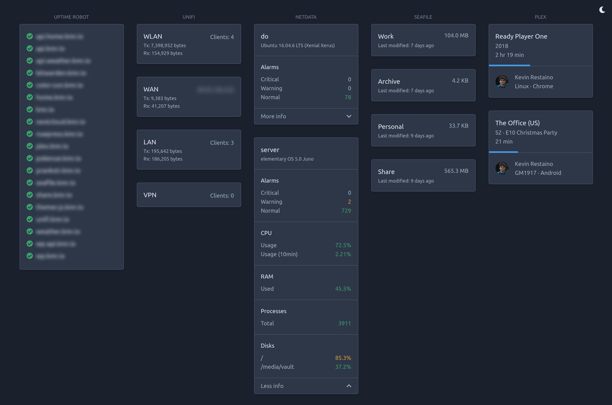

# My Dash

Another dashboard for your self-hosted applications.



## API

The API fetches data and contains all the credentials to the various services you want to monitor.

### Development

#### Install dependencies

```
$ cd api

# using yarn
$ yarn install

# using npm
$ npm install
```

#### Start server

```
# from ./api/

# using yarn
$ yarn start

# using npm
$ npm run start
```

### Environmental Variables

First create an `.env` file at the root of the [api](api) folder. Follow the template file at [api/.env.template](api/.env.template) as an example.

#### `API_KEY`

This can be anything you want. The key is used by the UI as a form of authentication. Each request to the API contains this key as a parameter.

Upon first load of the UI, you will be prompted to enter this key. It is stored in `localStorage` so you don't need to enter it every time. If for some reason you need to update it, just delete the key using your browser's dev tools or by clearing the site data.

If the API rejects the key, the UI will automatically delete the invalid key in `localStorage` and ask you to reauthenticate.

#### `UI_ORIGIN`

`CORS` is also enabled on the API. For local development, this is `http://localhost:3000`, unless you changed the port number. For production environments, remember to set the correct origin as `http://localhost:3000` is probably not what you want.

## UI

The UI fetches data gathered by the API and renders the content. Styling is all handled by [Tailwind CSS](https://tailwindcss.com/), head over there to learn more about it.

### Development

#### Install dependencies

```
$ cd ui

# using yarn
$ yarn install

# using npm
$ npm install
```

#### Start development server

```
# from ./ui/

# using yarn
$ yarn start

# using npm
$ npm run start
```

#### Build for production

```
# from ./ui/

# using yarn
$ yarn build

# using npm
$ npm run build
```

### Environmental Variables

First create an `.env` file at the root of the [ui](ui) folder. Follow the template file at [ui/.env.template](ui/.env.template) as an example.

#### `REACT_APP_API_URL`

The URL of your API server. For local development, this is `http://localhost:4000`, unless you changed `API_PORT` in the API `.env` file. For production environments, remember to set the correct URL as `http://localhost:4000` is probably not what you want.

## Adding your own services

I recommend you check out the two folders [api/src/routes](api/src/routes) and [ui/src/components/services](ui/src/components/services) to see how the existing services are implemented.

But as a _very_ brief walk-through:

1. Add endpoints and/or credentials to the corresponding `.env` file.
2. Create a new route in [api/src/routes](api/src/routes) with the name of your new service. All files in the routes folder are automatically imported.
3. Create a new component in the [ui/src/components/services](ui/src/components/services) folder and import it into the main app entry point [ui/src/index.js](ui/src/index.js).
4. Render the data however you want.

## FAQ

### How do I get my Uptime Robot API key?

https://uptimerobot.com/api

### You want me to add my Unifi username and password, are you insane?

I agree, but we can mitigate the security vulnerability by creating a new `admin` with `Read Only` access.

Head over to `YOUR_UNIFI_URL/manage/site/default/settings/admins/list` and create a new admin with those limited privileges.

### Where are the Netdata API docs?

https://docs.netdata.cloud/web/api/

### How do I get my Seafile API token?

https://download.seafile.com/published/web-api/home.md

### How do I get my Plex API token?

Login to your Plex application, open up your dev tools and inspect any of the `XHR` requests. Look for the parameter `X-Plex-Token`.

## Contributing

I'm happy to accept pull requests to this repo that contain bug fixes, code cleanup, refactoring, or general improvements to the existing code base. If you want to add new services, I suggest you fork the repo. This repo is meant to be a template for you, not a megalithic repo that has components for every service under the sun.

If you have a suggestion on a way to abstract the API and UI components so they can be shared, please let me know! As I was developing it, I realized I was making a lot of very opinionated decisions regarding how data is fetched and rendered. In an effort to get this out the door and share it, I decided it would be best if people just forked it.
